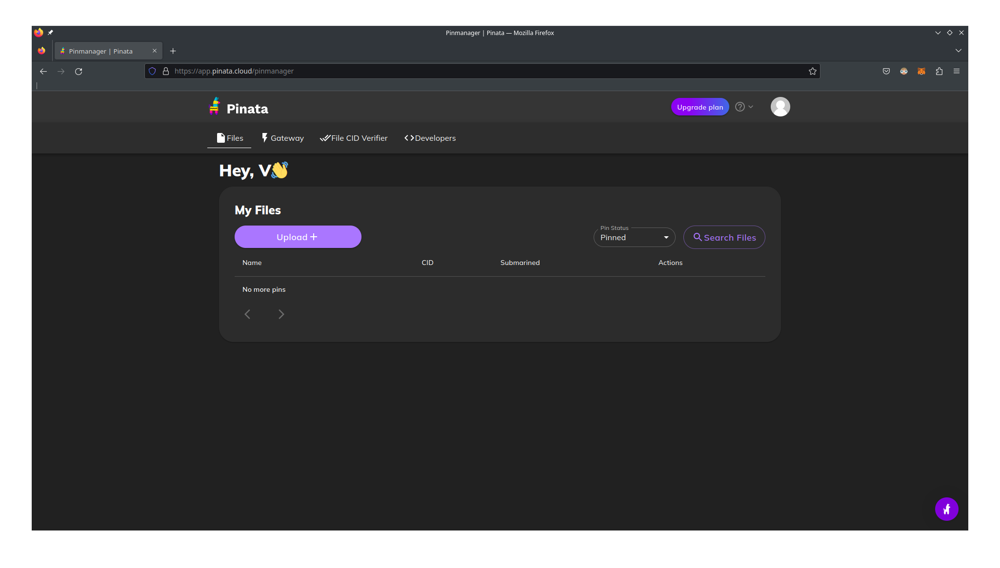
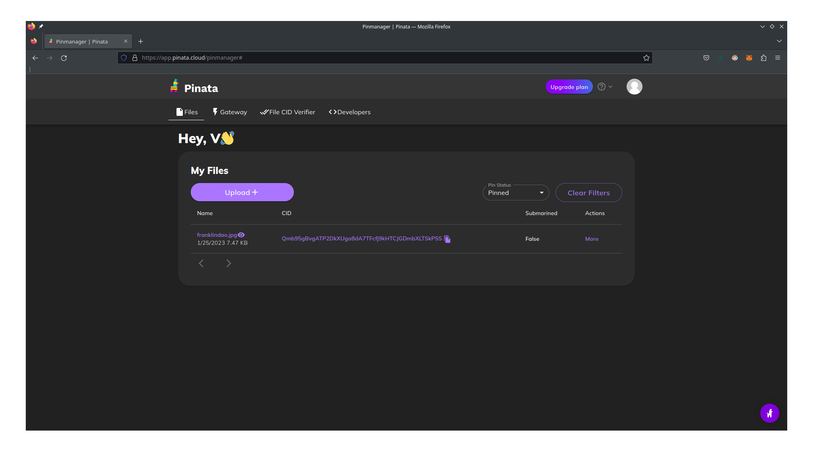
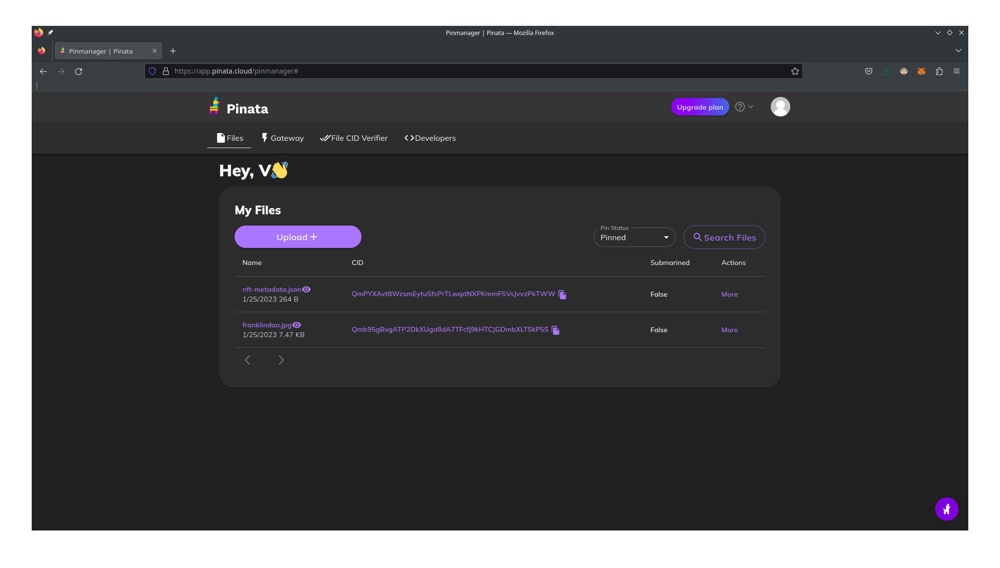

# Week 2 Guide

This week, we'll be teaching you how to write a simple NFT smart contract. We'll host the images on IPFS using Pinata.

## Quickstart

We assume you already have nodejs, hardhat, etc. installed. If not, please follow the instructions from the previous
week.

```shell
npm install
npx hardhat compile
npx hardhat test
```

## Task 1: Writing the ERC-721 contract

`contracts/PennFT.sol` is an ERC-721 contract. Most of the methods are inherited from the base ERC-721 contract, but we
want to add a few more methods to store the metadata so we can attach an image to our NFT.

Before editing the contract, run `npx hardhat test` to see the tests fail. You should then write some more tests before
editing the contract to make sure you understand the interface.

Next, your task is to complete the contract, adding any variables, initializing them and finishing `mintNFT`, `tokenURI`
and `tokenCount` methods.

Note for minting the NFT, you can use the `_mint(address, id)` function in the ERC-721 base contract.

Once you are done finishing the methods, you should be able to run `npm hardhat test`, and the tests should pass.

## Task 2: Uploading NFT data

1. Create an account on [Pinata](https://pinata.cloud/).
2. Upload an image by clicking 'Upload'.
   
3. Upload `franklindao.jpg`, or another image of your choosing.
4. Wait a few moments for the file to appear.
   
5. Copy the image IPFS URI into `nft-metadata.json`.
6. Upload `nft-metadata.json` to Pinata.
   
7. Copy the metadata IPFS URI into `scripts/MintPennFT.js`.

## Task 3: Deploying the contract

1. Run `npx hardhat node`
2. Run `npx hardhat run scripts/PennFT.js --network localhost`
3. Copy the smart contract address into `scripts/MintPennFT.js`.
4. Run `npx hardhat run scripts/MintPennFT.js --network localhost`

This should mint an NFT! Congrats, you've minted your first one!

## Task 4: Ethers.js

Your final task is to add more methods to the `scripts/MintPennFT.js` file to play around with the contract more. We've
added some sample things you should do, but feel free to add additional methods and test other features of the ERC-721
token.
