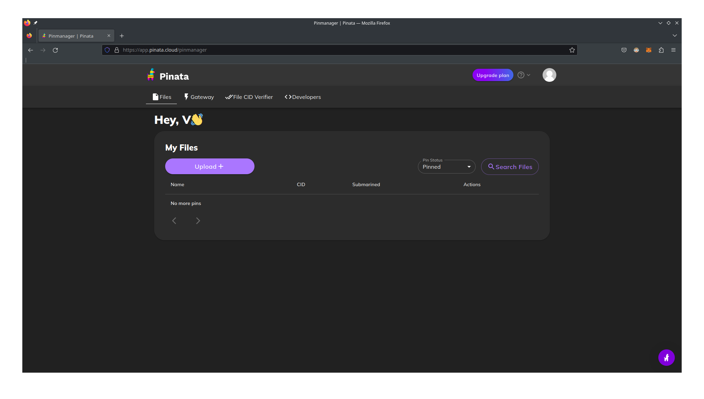

# Week 2 Guide

This week, we'll be teaching you how to write a simple NFT smart contract. We'll host the images on IPFS using Pinata.

## Quickstart

We assume you already have nodejs, hardhat, etc. installed. If not, please follow the instructions from the previous
week.

```shell
npm install
npx hardhat compile
npx hardhat test
```

## Uploading

1. Create an account on [Pinata](https://pinata.cloud/).
2. Upload an image by clicking 'Upload'.

3. Upload `franklindao.jpg`, or another image of your choosing.
4. Wait a few moments for the file to appear.